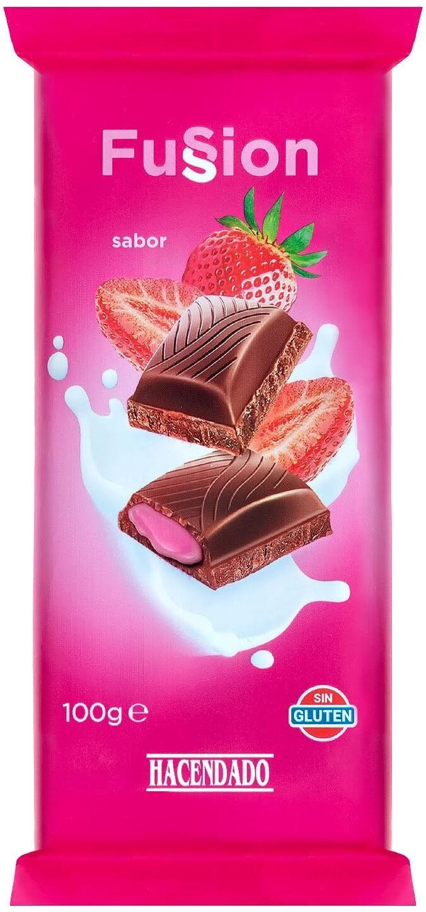

<!DOCTYPE html>
<html lang="en">

<head>
  <meta charset="UTF-8" />
  <meta name="viewport" content="width=device-width, initial-scale=1.0" />
  <title>MI MUNDO NATALY</title>
  
</head>

<body>
  <!-- Definimos el area del encabezado -->
  

      <h1> 🤎CHOCOLATE DE CANELA 🤎</h1>
  

  <!-- Crear el menu -->
  

    <a href="https://www.mined.gob.sv/" >VIVE</a>
	        <!--p align="rigth">MINED -->
    <a href="#">DULCEMENTE</a>
    <a href="#">LA VIDA</a>
	<a href="https://www.nintendo.com/us/">NATALYCHASHTE</a>
    
  

  <!-- cuerpo de la pagina -->
  
`
    

      <h2> LOS MEJORES CHOCOLATES </h2>
      
 Los mejores chocolates los encuentras aqui.

    

    

      <h2> DE CANELA </h2>
      
 wooo que dulzura

    

    

      <h2>chocolates</h2>
      
 Que delicia.

    

  

  <!-- inicio del piede de pagina -->
  

   <marquee> 
 <h3> CON COCO🥥,ALMENDRAS🌰 Y FRESAS🍓</h3> 
</marquee>
  

  

  
  

    
 <h3>DULZURA EN CADA BOCADO 😋</h3> 

  

  

 
  

   <MARQUEE> 
  <h3>  💲LOS PRECIOS SON DE, $3 Y $4 💲 </h3> 

  

  
</MARQUEE>

    

  
  

    
 <h3> 🤎 DISFRUTA CADA MOMENTO CON TUS CHOCOLATES FAVORITOS 🤎 </h3> 

  

  

   
  
  <audio controls> <source src="lapaz.mp3" type="audio/mp3"> Tu navegador no soporta audio HTML5. </audio>
 
  <marquee>  </marquee>
  <marquee behavior="alternate">  </marquee>

     <video width="600" height="400" controls>
    <source src="pp.mp4" type="video/mp4">
       </video>
	   
	    
	   
	   
    
	<a href="Base Access China.html"> Registros  </a>   
	
	<A HREF="index.html">  A hoja 2  </A>  
    <A HREF="iindex.html"> A hoja 3 </A>

<!DOCTYPE html>
<html lang="es">
<head>
  <meta charset="UTF-8">
  <title>Registro de Visitantes</title>
  
</head>
<body>

  <!--

    <h2>Registro de Visitantes</h2>
    <form action="procesar_registro.php" method="POST">
      <label for="nombre">Nombre completo:</label>
      <input type="text" id="nombre" name="nombre" required>

      <label for="correo">Correo electrónico:</label>
      <input type="email" id="correo" name="correo" required>

      <label for="motivo">Motivo de la visita:</label>
      <textarea id="motivo" name="motivo" rows="3" required></textarea>

      <label for="fecha">Fecha de entrada:</label>
      <input type="date" id="fecha" name="fecha" required>

      <label for="hora">Hora de entrada:</label>
      <input type="time" id="hora" name="hora" required>

      <label for="identificacion">Número de identificación (DUI, carnet, etc.):</label>
      <input type="text" id="identificacion" name="identificacion">

      <button type="submit">Registrar</button>
    </form>
  
 -->

<!--<iframe src="https://docs.google.com/forms/d/e/1FAIpQLSf6LXQ_qTlCHSNC-ZgxwdEln37_t5v2Hh6ocDeD2i2wPafUCA/viewform?embedded=true" width="640" height="568" frameborder="0" marginheight="0" marginwidth="0">Cargando…</iframe>-->

https://docs.google.com/spreadsheets/d/13HsCcHAgIrKN511fNy1tgMPfpdHYnRiSEOrYHAERCoE/edit?usp=sharing

</body>
</html>
    

